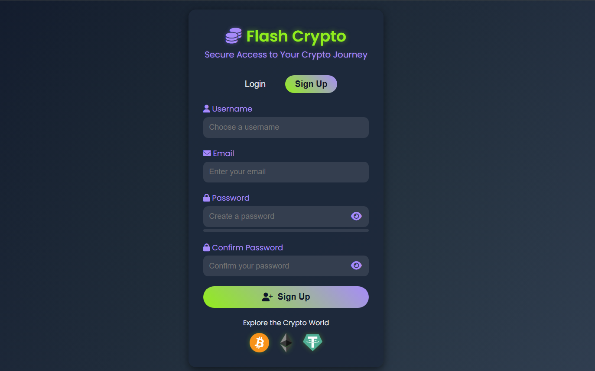
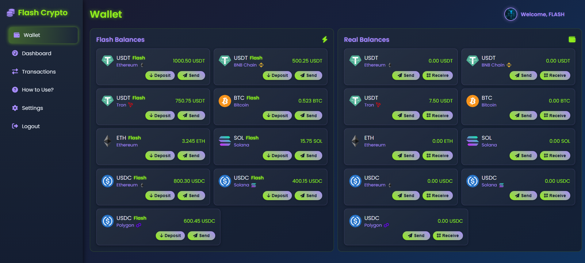
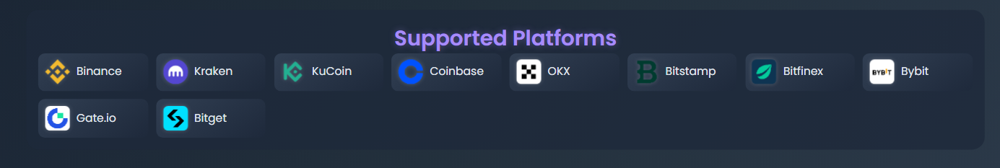
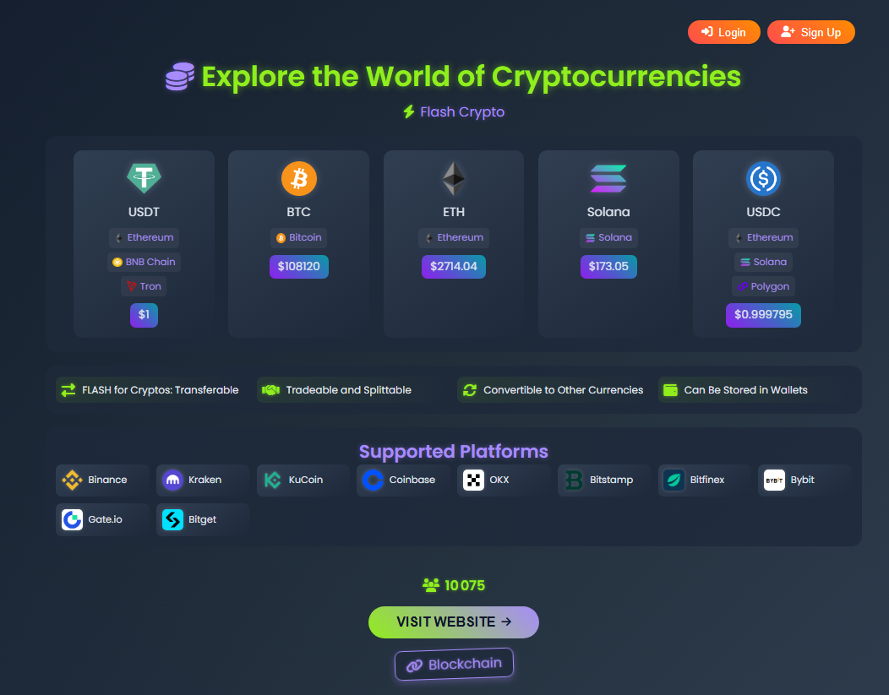

  

# 🌟 Flash USDT 💎

🔐 **Flash USDT** is a dynamic, secure, and visually stunning platform for managing **Flash USDT Balances** and **Real USDT Balances** on the **TRC20** network. With real-time CoinGecko price updates and integration with top exchanges like **Binance**, **Coinbase**, and **Kraken**, it’s your gateway to fast, ethical USDT transactions! 🚀

🌐 **Website**: [Flash USDT](https://flash-cryptov2.netlify.app)

---

## 🎉 Overview

Flash USDT offers a vibrant, user-friendly interface to manage **Tether (USDT)** on the **TRC20** network. Powered by CoinGecko for real-time pricing and integrated with leading exchanges, it ensures a seamless and secure experience. Use **Flash USDT Balances** for instant transactions or **Real USDT Balances** for secure storage, all while prioritizing ethics and ease of use. 🌈

---

## ✨ Key Features

- 🟢 **Instant Flash USDT Balances**: Access USDT on TRC20 for rapid transactions.
- 🔗 **TRC20 Network Support**: Fast, low-cost USDT transactions on Tron.
- 📈 **Real-Time USDT Prices**: Powered by CoinGecko API.
- 💸 **15% Withdrawal Fee**: Deducted from Real USDT Balances for Flash USDT transactions.
- 📱 **Responsive Design**: Optimized for desktop, tablet, and mobile with vibrant gradients.
- 🔥 **Firebase Integration**: Secure authentication and data storage.
- 💬 **Interactive Support Chat**: Instant assistance via built-in chat panel.
- 🌐 **Social Media Integration**: Connect via Telegram, Discord, X, and Facebook.
- 🏦 **Supported Exchanges**: Trade USDT on Binance, Coinbase, Kraken, and more.
- 🖼️ **Vibrant USDT Logo**: Professional Tether logo for a polished experience.

---

## 🚀 Getting Started

1. **Visit the Website** 🌐  
   Open [Flash USDT](https://flash-cryptov2.netlify.app).

2. **Sign Up** 🔐  
   Click **Sign Up** to create an account with Firebase Authentication and access **Flash USDT Balances**.  
   

3. **Explore USDT** 💰  
   View real-time USDT prices on the TRC20 network.  
   

4. **Discover Supported Exchanges** 🏦  
   Trade USDT on platforms like Binance, Coinbase, and Kraken.  
   

5. **Manage Balances** 💸  
   Log in to the dashboard to send or deposit **Flash USDT Balances** (15% fee applies).

6. **Get Support** 💬  
   Use the **Support Chat** panel for instant help.

---

## 💲 Pricing

- **Flash USDT Transactions**: 15% fee deducted from Real USDT Balances (e.g., 100 Flash USDT costs 15 Real USDT).
- **Real USDT Deposits**: No fees for depositing USDT on TRC20.
- **Flash USDT Top-Up**: Refill Flash USDT Balances with no extra charges.

---

## ⚠️ Disclaimer

⚠️ **Important**: Flash USDT is for **ethical and legal use only**. Fraudulent activities, including deceptive use of Flash USDT, are strictly prohibited. Transactions are verified on the TRC20 blockchain, and misuse may lead to account suspension. See our [Terms of Service](#).

---

## 🖼️ Logos

Flash USDT features a bold platform logo and the Tether icon, stored in the `logos/` folder:

| Item                     | Logo File                   | Description                        |
|--------------------------|-----------------------------|------------------------------------|
| **Flash USDT (Main Logo)** | `flash-usdt-logo.png`      | Official Flash USDT logo           |
| Tether (USDT)            | `tether-usdt-logo.png`      | USDT logo for TRC20 transactions   |
| Tron (TRC20)             | `tron-trx-logo.png`         | Tron logo for TRC20 USDT           |

---

## 🏦 Supported Exchanges

Flash USDT integrates with leading exchanges for seamless USDT trading:

- 🟡 **Binance**
- 🔵 **Coinbase**
- 🐙 **Kraken**
- 🟢 **KuCoin**
- ⚫ **OKX**
- 🔴 **Bitstamp**
- 🟣 **Bitfinex**
- 🟠 **Bybit**
- 🔷 **Gate.io**
- 🔺 **Bitget**

View official exchange logos in the **Supported Platforms** section on the homepage.

---

## 🌐 How to Contribute

### 🛠️ Developer Access Program

Help improve Flash USDT’s features and security! 🌟

#### How to Gain Free Access:
1. **Contribute**:  
   Fork the repository and submit pull requests with enhancements for USDT functionality.  
   Contact us on [Telegram](https://t.me/Mistreccv) to discuss contributions.
2. **Submit Proof**:  
   Share your pull request or contribution details via Telegram.
3. **Receive Access**:  
   Verified contributors get **free, lifetime access** to all Flash USDT features.

### 🙌 For Non-Developers:
- **Subscription Access**:  
  Contact us on [Telegram](https://t.me/Mistreccv) for premium subscription details.  
  Pricing: Reach out for current rates.

---

## 💎 Special Features

- 🔄 **Transferable USDT**: Move Flash and Real USDT Balances on TRC20.
- 🤝 **Tradeable & Splittable**: Flexible Flash USDT usage.
- 🔀 **Convertible USDT**: Convert Flash USDT to other currencies on supported exchanges.
- 💼 **Wallet Storage**: Store USDT in TRC20-compatible wallets.
- 📊 **Dynamic User Counter**: Live counter showcasing community growth.
- ✅ **Blockchain Stamp**: TRC20 blockchain-verified for trust.
- 🏦 **Supported Exchanges**: Trade USDT on top platforms with ease.

---

## 📲 Stay Connected

- 📩 **Join Our Telegram**: [Join Telegram](https://t.me/Mistreccv) for updates and community.  
- 🌐 **Social Media**: [ Telegram](https://telegram.org)  
- 🆘 **Need Help?**: Use the **Support Chat** panel or contact us on [Telegram](https://t.me/Mistreccv).

---

## 📸 Screenshots

Explore Flash USDT’s vibrant interface:

1. **Flash USDT Logo**  
   
2. **Homepage**: USDT prices and TRC20 details  
   
3. **Sign-Up Page**: Firebase Authentication  
   
4. **USDT Section**: Tether and TRC20 details  
   
5. **Supported Platforms**: Top exchanges for USDT  
   
6. **Support Chat**: Interactive chat panel

---

  Built with 💖 for the crypto community

